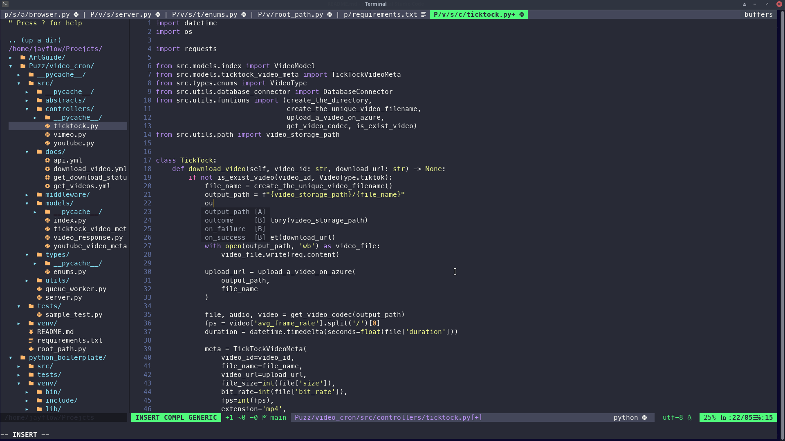

# NeoVim Config file



## Start Guide

### 1. Install Neovim

```bash
sudo snap install --beta nvim --classic
```

### 2. Git repo clone

```bash
git clone https://github.com/Jay-flow/nvim.git ~/.config/nvim
```

### 3. Plug Install

1. Install [vim-plug](https://github.com/junegunn/vim-plug)

```bash
sh -c 'curl -fLo "${XDG_DATA_HOME:-$HOME/.local/share}"/nvim/site/autoload/plug.vim --create-dirs \
       https://raw.githubusercontent.com/junegunn/vim-plug/master/plug.vim'
```

2. Open the init.vim file

```bash
nvim ~/.config/nvim/init.vim
```

3. Install Plugin

```bash
:PlugInstall
```
